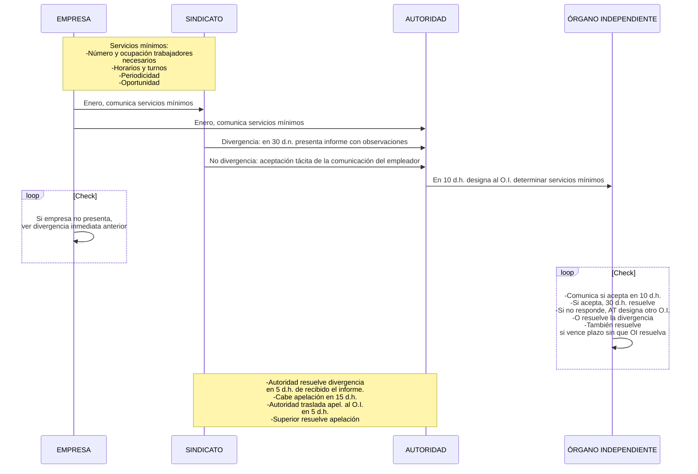

```mermaid
sequenceDiagram
    participant EMPRESA
    participant SINDICATO
    participant AUTORIDAD
    participant ÓRGANO INDEPENDIENTE
    Note over EMPRESA, SINDICATO: Servicios mínimos: <br/>-Número y ocupación trabajadores <br/>necesarios <br/>-Horarios y turnos <br/>-Periodicidad <br/>-Oportunidad
    EMPRESA->>SINDICATO: Enero, comunica servicios mínimos
    EMPRESA->>AUTORIDAD: Enero, comunica servicios mínimos
        SINDICATO->>AUTORIDAD: Divergencia: en 30 d.n. presenta informe con observaciones
    SINDICATO->>AUTORIDAD: No divergencia: aceptación tácita de la comunicación del empleador
    AUTORIDAD->>ÓRGANO INDEPENDIENTE: En 10 d.h. designa al O.I. determinar servicios mínimos
    loop Check
       EMPRESA->>EMPRESA: Si empresa no presenta, <br/>ver divergencia inmediata anterior
    end
        loop Check
        ÓRGANO INDEPENDIENTE->>ÓRGANO INDEPENDIENTE: -Comunica si acepta en 10 d.h. <br/>-Si acepta, 30 d.h. resuelve <br/>-Si no responde, AT designa otro O.I. <br/>-O resuelve la divergencia <br/>-También resuelve <br/>si vence plazo sin que OI resuelva
    end 
    Note over SINDICATO, AUTORIDAD:-Autoridad resuelve divergencia <br/>en 5 d.h. de recibido el informe. <br/>-Cabe apelación en 15 d.h. <br/>-Autoridad traslada apel. al O.I. <br/>en 5 d.h. <br/> -Superior resuelve apelación
    
    
```
